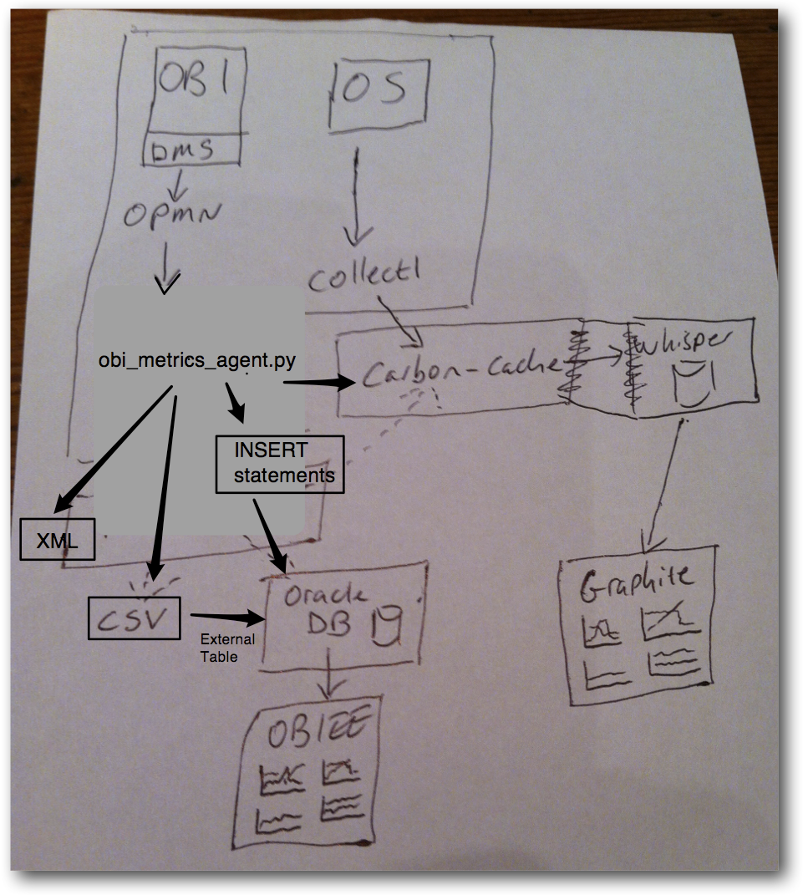
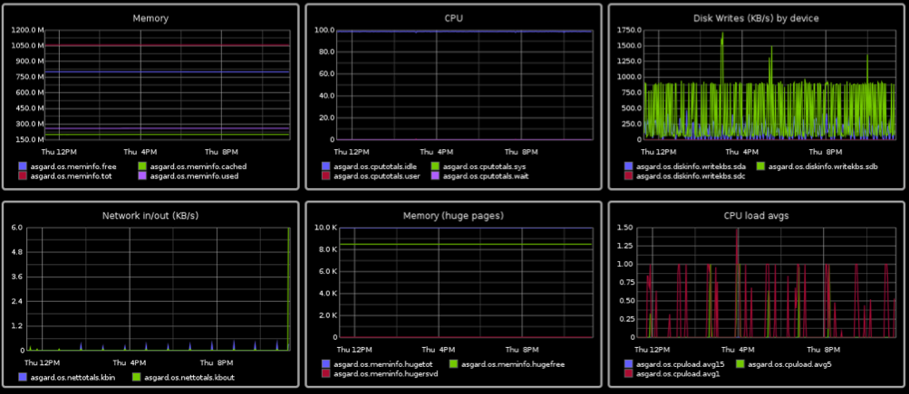

# obi-metrics-agent.py							

	===================================================================
	Developed by @rmoff / Rittman Mead (http://www.rittmanmead.com)
	Absolutely no warranty, use at your own risk
	Please include this notice in any copy or reuse of the script you make
	===================================================================

## Introduction

**obi-metrics-agent** is a tool that extracts OBIEE's performance metrics from the [Dynamic Monitoring Service (**DMS**)](http://docs.oracle.com/cd/E23943_01/core.1111/e10108/dms.htm#CIHCFIFA) functionality. 

It can poll DMS on a specified interval and output the data to a variety of formats. It was written to aid OBIEE performance monitoring either as part of testing or longer-term use. 

It features: 

* In-built scheduler/timer
* Multiple output options: 
	* CSV
	* INSERT statements
	* Carbon, (for rendering in Graphite etc)
	* Unparsed XML
	* Unparsed raw opmn output
* Parse data as it is collected, or write to disk
* Parse data collected previously

### Which OBI metrics are collected?
All of the ones that OPMN supports. Currently, BI Server and BI Presentation Services, plus the opmn process metrics (such as CPU time of each OBI component)

To explore the DMS metrics available, you can use Enterprise Manager, or the [DMS Spy](http://docs.oracle.com/cd/E15586_01/core.1111/e10108/monitor.htm#CFAHIAIB) servlet that is installed by default with OBIEE and available at `http://<obi-server>:7001/dms/` (assuming your AdminServer is on port 7001).

### How are the metrics collected? 
Using the documented OPMN functionality to expose DMS metrics [`opmnctl metric op=query`](http://docs.oracle.com/cd/E14571_01/doc.1111/e14007/opmnctl.htm#CHDEFIDH) 

### Which platforms does it work on?

* Tested thoroughly on OL 5.5 and OL6.3
* Works on Windows 2003, 2008R2

### Known Issues 

Prior to OBIEE 11.1.1.7, there was a bug in the opmn process which causes corrupt XML sometimes. This could sometimes be as much as 15% of samples. On corrupt samples, the datapoint is just dropped. 

The patch for this issue is 13055259. 

### Limitations

Only single-node clusters are currently supported. Modification of the parsing code would  be necessary to handle additional instances. 

### What about Enterprise Manager? 

Enterprise Manager Fusion Middleware Control (that ships with all OBIEE installations) does not retain history of metrics, which obi-metrics-agent enables out of the box. Enterprise Manager Cloud Control (with the BI Management Pack) does enable history of DMS metrics to be collected, but requires additional licences. 

## Installation 

**obi-metrics-agent** requires just Python (minimum 2.4), and the `lxml` library

Download the `obi-metrics-agent.py` script, or clone the git repository, on to the OBIEE server. The script will need to be able to execute as a user with permission to call opmnctl - in practice this would be the same OS user as is used to run OBIEE.

For full installation details, please see [INSTALL.md](INSTALL.md)

## Instructions for use

### Introduction

**obi-metrics-agent** collects OBI metrics data from DMS via opmn. It has three modes:  

1. Collect and parse metrics to output
2. Collect metrics to disk only
3. Parse existing metrics from disk

### Which mode to use?

1. Collect and parse metrics to output
	* Near-real-time rendering of OBI metrics in Graphite
	* Near-real-time load of data into Oracle (via CSV & external table)
2. Collect metrics to disk only
	* For analysis at a later date
	* If graphite/carbon is not available to send data to
	* If outbound network bandwidth is constrained (or could be, by OBIEE)
	* For lowest host system overhead
3. Parse existing metrics from disk
	* Parse previously collected data and output to Graphite or Oracle (via CSV & external table)

### Example usage
#### Collect and Parse - output to Carbon/Graphite

1. Make sure there is a Carbon/Graphite server available 
3. Run **obi-metrics-agent.py**

		python $FMW_HOME/obi-metrics-agent/obi-metrics-agent.py --opmnbin $FMW_HOME/instances/instance1/bin/opmnctl --output carbon --carbon-server graphite_server
4. View Graphite dashboards, by default at `http://<graphite_server>/dashboard/`

#### Collect and Parse - output to Oracle/OBIEE

1. Initial Set up:
	1. Prepare a script based on the DDL in the appendix below. Amend the CREATE DIRECTORY definition to point to the folder that holds the csv file (`data-directory` specified to obi-metrics-agent.py, see below)
	2. Execute the DDL as SYSDBA. It will create a user and external table definition.
3. Run **obi-metrics-agent.py**
		python $FMW_HOME/obi-metrics-agent/obi-metrics-agent.py --opmnbin $FMW_HOME/instances/instance1/bin/opmnctl --output csv --data-directory ~/data
4. Viewing the output:
	1. Data can be queried directly through Oracle as DMS_METRICS_EXT
	2. Use Create Table As Select (CTAS) to copy data to permanent Oracle table
	3. Use OBIEE or alternative tool to render the data from the table
		
#### Collect metrics to disk (for processing at a later date)
1. Initial Set up: none
3. Run `obi-metrics-agent.py`
		python $FMW_HOME/obi-metrics-agent/obi-metrics-agent.py --opmnbin $FMW_HOME/instances/instance1/bin/opmnctl --output raw --data-directory ~/data

#### Parse existing metrics from disk, output to CSV file
1. Run `obi-metrics-agent.py`

		python $FMW_HOME/obi-metrics-agent/obi-metrics-agent.py --opmnbin $FMW_HOME/instances/instance1/bin/opmnctl --output csv --parse-only

#### Parse existing metrics from disk, output to Carbon/Graphite
1. Run `obi-metrics-agent.py`
	
		python $FMW_HOME/obi-metrics-agent/obi-metrics-agent.py --opmnbin $FMW_HOME/instances/instance1/bin/opmnctl --parse-only --output carbon --carbon-server localhost


*NB this may flood carbon and might need throttling; not clear how carbon handles an influx of data. *Maybe update obi-metrics-agent to send pickles for efficiency?**

#### Example usage on Windows

*Calling obi-metrics-agent on Windows is no different from calling it on Linux. Depending on how Python has been installed you may need to directly reference the Python executable*

	c:\Python27\python.exe c:\git\obi-metrics-agent\obi-metrics-agent.py --opmnbin c:\oracle\middleware\instances\instance1\bin\opmnctl.bat 

## Architecture

## Rendering the data
### Graphite
[Graphite](http://graphite.readthedocs.org/en/latest/index.html) is an open-source graphing platform specifically for time-based metrics. It includes its own database (“whisper”) and database collector agent (“carbon”). 

Graphite is an optional target for obi-metrics-agent. The obi-metrics-agent can be deployed standalone.

Graphite as it is also supported by collectl, an excellent OS monitoring tool favoured by the likes of Kevin Closson and Greg Rahn. 

Using graphite, any metrics held in its database can quickly be rendered into a graph. Because Graphite is all about time-based measurement, we can easily overlay OBI metrics with OS metrics in the same graphs. 

### Why not use OBIEE for drawing graphs? 

We can, if we want. The OBI metric data can be loaded in by external table from the CSV files, or using the generated INSERT statements. 

Using Graphite gives an alternative to a dependency on OBIEE because rendering the data on the system that we’re also testing complicates things. If we then set up a second OBIEE server just for rendering graphs then it opens up the question of what’s the best graphing tool for this particular job, and Graphite is a strong option here. 

### How do I install Graphite? 

Graphite requires Python 2.6 with several libraries. It will install without problem on RHEL 5 and RHEL 6 derivative Linuxes (including Oracle Linux) as well as Ubuntu. I've not tested it on other *nixes, Mac or Windows.

Fully automated installation scripts, along with installation walk-throughs, are provided. Details vary slightly depending on the version of your OS: 

* [Oracle Linux 5](INSTALL_GRAPHITE_OL5.md) (including Cent OS 5 and RHEL 5)
* [Oracle Linux 6](INSTALL_GRAPHITE_OL5.md) (including Cent OS 6 and RHEL 6)

## Appendix: DDL for accessing obi-metric-agent data in Oracle

	create user obi-metrics IDENTIFIED BY Password01;
	GRANT CONNECT, RESOURCE, CREATE ANY DIRECTORY TO obi-metrics;

	CONNECT obi-metrics/Password01

	CREATE TABLE DMS_METRICS (METRIC VARCHAR(250),VALUE INT,TIME_EPOCH INT);
	CREATE UNIQUE INDEX DMS_METRIC_IX ON DMS_METRICS (METRIC,TIME_EPOCH);

	CREATE OR REPLACE DIRECTORY DMS_DATA AS '/change/this/path/to/where/data/is/written/';

	DROP TABLE DMS_METRICS_EXT;
	CREATE TABLE DMS_METRICS_EXT (METRIC VARCHAR(250),VALUE INT,TIME_EPOCH INT)
	ORGANIZATION EXTERNAL
	(TYPE ORACLE_LOADER
	     DEFAULT DIRECTORY DMS_DATA
	     ACCESS PARAMETERS
	       (records delimited BY newline
		fields
		    terminated BY ','
		    optionally enclosed BY '"'
		    missing field VALUES are NULL
	      )
	     LOCATION ('metrics.csv')
	  );

	exit

